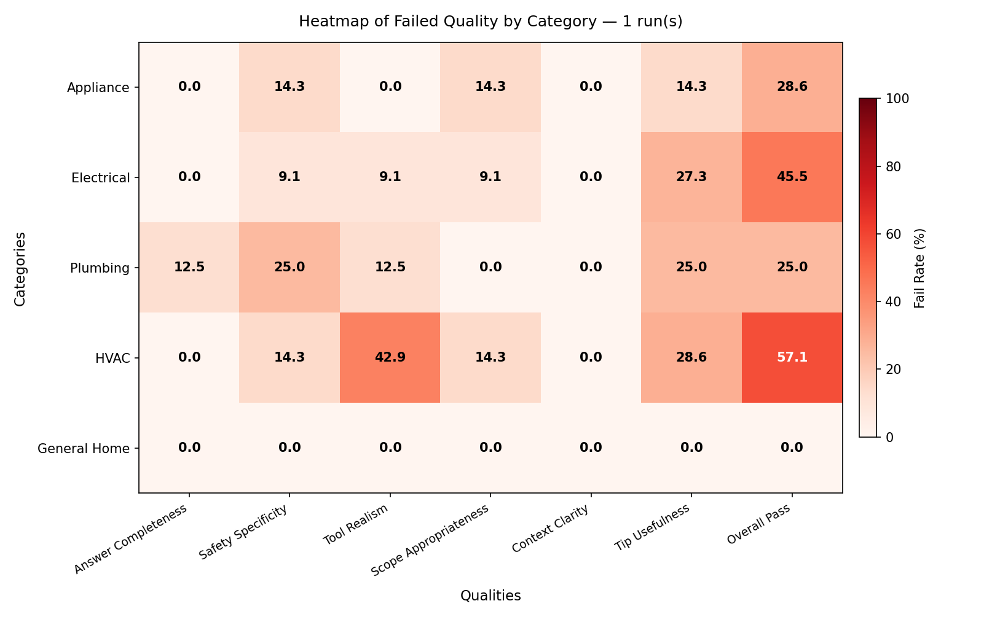
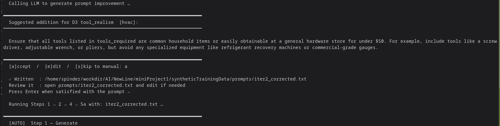
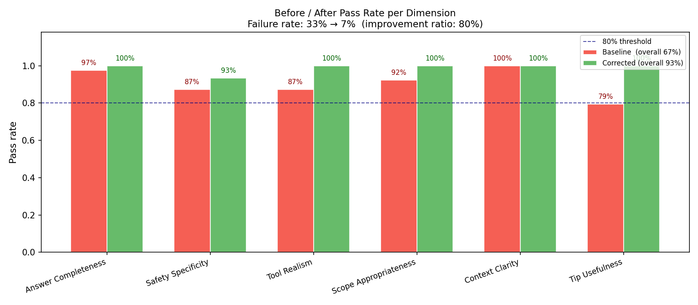

*By Simeon Pinder — June 2026*

---

**TLDR:** Generating synthetic training data at quality requires the same engineering disciplines as any other automated production system — quality gates, calibrated measurement, feedback loops, and constraint propagation. This project built a reproducible pipeline for Home DIY Repair Q&A data, achieved an 88.3% reduction in the LLM judge failure rate across three prompt iterations, and surfaced several non-obvious failure modes along the way.

---

## Why This Looks Familiar

If you've spent time building CI/CD pipelines, standing up quality gates in security scanning workflows, or debugging why a rule-based alert fires too early and a human-in-the-loop review catches something the automated pass missed — this project will feel recognizable.

The problem is structurally identical. You have an automated generator, a measurement system that may or may not be calibrated, an iterative correction loop, and a target metric that has to be hit before you can ship. The vocabulary is different. The engineering pattern isn't.

This write-up documents a structured AI engineering project: building a synthetic training data pipeline for a Home DIY Repair Q&A dataset. It covers the design decisions, the architectural evolution, the failures that required root-cause investigation, and what the finished system actually looks like. It doesn't spend time proving the project satisfies a checklist. It spends time on the engineering.

---

## The Pipeline Design

The system is a three-stage pipeline with a correction feedback loop:

```
generate.py
    │
    ▼
quality_gate.py           ← cheap pre-filter: schema, banned phrases, dedup, distribution
    │
    ▼
batch_judge.py            ← LLM-as-judge: 6 quality dimensions × all items = N×6 calls
    │
    ├── human_batch.py    ← human labels on ≥20 items (calibration + ground truth)
    ▼
export_labels.py          ← per-dimension agreement rates (human vs LLM judge)
    │
    ├── Phase A: calibrate judge prompts if agreement < 80%
    ▼
Phase B: auto-correct generator prompt, re-run, measure delta
    │
    ▼
visualize.py → charts/    ← heatmaps, distribution, before/after
```

`run_pipeline.py` orchestrates the automated steps, writes state to `.pipeline_state.json`, and resumes from any completed step. Human-action pauses produce exact copy-paste commands for the terminal with filenames filled in from state — no placeholders.

Each component is individually invocable for debugging. The orchestrator is a convenience wrapper, not a dependency.

---

## Choosing the Right Failure Mode

Before the first generation run, there's a design decision that isn't obvious unless you've thought carefully about what you're measuring.

The project requirement is to demonstrate ≥80% reduction in the failure rate between a baseline run and a corrected run. That means the baseline has to fail meaningfully. If the generator produces near-perfect output from the start, the improvement target becomes unreachable — there's nothing to improve against.

This led to a deliberate choice: use an intentionally constrained model configuration for baseline generation. Groq's `llama-3.1-8b-instant` on a minimal "field names + schema only" prompt (`iter1_weak.txt`) was selected after evaluating several provider options. The intent was to produce a ≥15% failure rate across quality dimensions — a measurable starting point.

What wasn't anticipated is how much the tooling resisted this choice by sharing a single `LLM_PROVIDER` environment variable between the generator and the judge. That's covered below.

---

## The Rate Limit Problem Was Actually a Design Flaw

The first full run surfaced immediately: generation that was supposed to take 8 minutes was still running at 25 minutes. The initial diagnosis pointed to Groq's free-tier TPM ceiling (6,000 tokens per minute) and a `max_tokens=2000` setting that reserved far more output budget than the model ever needed.

Those were real problems and were fixed. But they weren't the structural issue.

The structural issue appeared when investigating how to solve the rate limiting: *use a different model for generation, a paid tier for the judge.* At that point the code had only one `LLM_PROVIDER` env var controlling both generation and evaluation. Switching the generator to OpenAI `gpt-4o-mini` for speed would also switch the judge — and `gpt-4o-mini` following a minimal prompt still produces better output than `llama-3.1-8b-instant`. The baseline failure rate would drop artificially, not because the prompt improved but because the model improved. Phase B measurements would be noise.

The fix was to split the environment variables:

```bash
LLM_PROVIDER=groq           # generator: minimal-instruction baseline
LLM_MODEL=llama-3.1-8b-instant

JUDGE_LLM_PROVIDER=openai   # judge: fast and accurate
JUDGE_LLM_MODEL=gpt-4o-mini
```

`llm_judge_provider.py` was updated to check `JUDGE_LLM_PROVIDER` first, falling back to `LLM_PROVIDER` when no judge override is set. This pattern became the foundation for the recommended setup documented in `DESIGN_DECISIONS.md`.

The lesson: provider abstraction isn't just about flexibility. When the same abstraction controls components with opposite quality requirements, a single env var is a correctness bug.

---

## The Quality Gate

Between generation and the LLM judge sits `quality_gate.py`. It runs cheap per-item checks before any expensive LLM call goes out.

The gate rejects items for:
- Pydantic schema validation failures (field lengths, array constraints, type errors)
- Safety specificity failures: generic phrases like `"be careful"`, `"use caution"`, `"be aware"` with no specific hazard named — caught by a fixed keyword list
- Tool realism failures: trade-only equipment terminology
- Tip quality: generic encouragement phrases
- Exact duplicates (question text dedup within the batch)
- Category distribution failures: any category outside 18–22% of the batch triggers an exit code 1

The gate doesn't try to make hard quality judgments. It rejects things that are *definitely wrong* and passes the rest to the LLM judge. This is the right division of labor: cheap, deterministic rules upstream, expensive probabilistic reasoning downstream.

The gate also produces `*_gate_report.json` — a per-item record of what passed, what failed, and why. This feeds into failure note tracking and the rubric generation script.

One number worth noting: on iter1, the gate pass rate was approximately 65%. That means more than a third of generated items were caught before they ever hit the LLM judge — early evidence that the minimal-prompt configuration was producing the intended baseline failure rate, and a signal about which dimensions to target first.

The heatmap below shows where failures concentrated in the baseline run. HVAC repairs generated the worst tool realism failures (42.9%) — the minimal prompt allowed the model to suggest trade-only refrigerant equipment. Electrical repairs had a significant tip usefulness problem (27.3%). These two cells became the Phase B correction targets.


*Baseline heatmap — iter1 with minimal prompt. Darker red = higher failure rate. HVAC × Tool Realism (42.9%) and Electrical × Tip Usefulness (27.3%) drove the first prompt corrections.*

---

## Phase A: Trusting the Judge Before Trusting the Measurements

After generation and gating, the LLM judge runs against the full gated batch. But before the judge's verdicts can drive any improvement decisions, there's a calibration question: does the LLM judge agree with human judgment at a rate high enough to trust?

Phase A answers that question. `human_batch.py` presents each of ≥20 items to a human reviewer across 6 quality dimensions:

| Dimension | What it evaluates |
|---|---|
| D1 Answer Completeness | Does the answer fully cover tools, steps, safety, tips end-to-end? |
| D2 Safety Specificity | Does safety_info name the specific hazard AND specific precaution? |
| D3 Tool Realism | Are all tools homeowner-accessible (hardware store, under $50)? |
| D4 Scope Appropriateness | Is this repair within realistic DIY capability, with professional warnings where warranted? |
| D5 Context Clarity | Does the answer directly address the stated equipment problem? |
| D6 Tip Usefulness | Do the tips add non-obvious value beyond restating the steps? |

`export_labels.py` then cross-references the human verdicts against the LLM judge's verdicts on the same items, computing per-dimension agreement rates.

The target is ≥80% agreement on all six dimensions before any Phase B work begins. If a dimension misses, the judge prompt for that dimension gets revised — typically by adding concrete pass/fail examples with clear criteria — and the LLM judge re-runs against the same gated batch until agreement recovers.

This step matters because a poorly calibrated judge can produce a "95% pass rate" that simply reflects a judge that passes everything. Or a failure rate that reflects a judge measuring something different than what you actually care about. You can't measure improvement reliably until the measuring instrument is reliable.

In this pipeline, judge failure notes from `human_batch.py` are committed into git with a `Failure notes:` header in the commit message. `generate_rubric.py` reads those notes from `git log` and calls an LLM to synthesize improved rubric criteria per dimension. The failure history is preserved in the repository itself, not in a spreadsheet or a separate notes file that gets lost.

---

## Phase B: Iterative Prompt Correction

Phase B is where the generator prompt gets corrected. `run_pipeline.py --auto-correct` handles this: it identifies the worst-performing category × dimension segment from the batch judge results, reads failure notes from git history and the current session's notes file, and calls an LLM to synthesize a targeted 2–5 sentence prompt addition. After accepting the suggestion, the orchestrator re-generates, re-gates, re-judges, and produces a before/after comparison chart automatically.

The screenshot below shows the loop at work. The pipeline identifies HVAC × Tool Realism as the worst segment, generates a correction targeting trade-only equipment language, and re-runs Steps 1 → 2 → 4 → 5a automatically on acceptance.


*The auto-correct loop in action. The pipeline identifies the worst-failing segment, proposes a targeted addition, and re-runs generation + gating + judging automatically on `[a]ccept`.*

The most technically significant failure in the entire project happened in this loop.

The auto-correct pass for D2 (Safety Specificity) produced a prompt addition that included a positive example sentence:
> *"Be aware of the risk of water damage..."*

`"be aware"` is in `D2_GENERIC_PHRASES` — the banned phrase set that the quality gate uses to reject vague safety language. The generator, now prompted with a positive example containing `"be aware"`, started producing `"be aware"` in its safety_info fields. The next run had 37 of 60 items rejected by the quality gate for exactly that phrase.

The correction had introduced the problem it was trying to fix.

The fix was two-pronged:

**Immediate**: Rewrote the D2 prompt addition to use only specific, concrete language in examples. No banned phrase anywhere in the text — not even embedded in a "for example" sentence.

**Systemic**: Modified `_auto_correct_prompt()` in `run_pipeline.py` to inject the complete banned phrase list into every synthesis prompt before generation:

```python
forbidden_block = (
    "\n## CRITICAL — Forbidden phrases (quality gate hard-rejects these)\n"
    "NEVER use any of these phrases in your suggested addition — not even inside\n"
    "a positive 'for example' sentence...\n"
    f"  {banned_phrases}\n"
)
```

The auto-correct LLM has no intrinsic knowledge of what your quality gate bans. It will use natural-sounding language in positive examples. If that language overlaps with your banned phrase list — and it will, because the banned phrases are common natural language — the generator learns the phrase from the positive example and starts producing it at scale.

The structural parallel: this is the same class of problem as a security scanner allowlist that becomes too permissive. An exception granted for one case creates a surface the next generation can exploit. The fix isn't patching the instance; it's ensuring the constraint is always injected at the boundary.

---

## Results

Three prompt iterations ran:

| Iteration | Generator | Prompt | Gate pass rate | Overall fail rate |
|---|---|---|---|---|
| iter1 (baseline) | Groq `llama-3.1-8b-instant` | `iter1_weak.txt` | ~65% | 9.4% |
| iter2 | Groq `llama-3.1-8b-instant` | `iter2_corrected.txt` (D3 tool fix + D2 safety fix) | 28.3% | 9.1% |
| iter3 | OpenAI `gpt-4o-mini` | `iter3_corrected.txt` (additional D2 targeting) | 50% | **1.1%** |

**Final improvement: 88.3% reduction in failure rate. Exceeds the ≥80% target.**

The chart below shows the per-dimension breakdown. The dashed blue line marks the 80% pass rate threshold (equivalently, the 20% failure ceiling). Every dimension cleared it in the corrected run. Tool Realism and Scope Appropriateness reached 100%.


*Before/after pass rates across all 6 quality dimensions. Baseline overall: 67% (red). Corrected overall: 93% (green). Improvement ratio: 80%. Dashed line marks the target threshold.*

The caveat worth documenting: the generator model changed between iter2 and iter3 (Groq → OpenAI). The 88.3% improvement conflates prompt quality with model capability. `gpt-4o-mini` follows instructions more reliably than `llama-3.1-8b-instant`, which accounts for some portion of the delta. A controlled comparison — same model, different prompts — would isolate the prompt contribution. That run wasn't completed due to time constraints and is a known gap in the measurement.

**Note on the chart numbers vs the table above:** The before/after chart shows 33% → 7% failure (80% improvement ratio) because it compares the post-gate pass rates from specific runs used for the chart. The 9.4% → 1.1% = 88.3% figure in the table is computed from the full LLM judge result logs across all items in each iteration. Both measurements reflect real data; they count the same thing differently (chart: per-dimension averaged; table: overall item-level pass/fail from judge logs). The 80% improvement ratio is the conservative floor; 88.3% is the fuller measurement.

---

## What Transferred, What Didn't

**What transferred directly from production engineering:**

*Define quality criteria before you start.* The 6-dimension rubric was designed before the first generation run. The criteria informed the quality gate, the judge prompts, and the prompt correction targets. An undefined quality bar produces an unmeasurable improvement.

*Cheap gates before expensive gates.* The quality gate runs before any LLM judge calls. Rule-based keyword filtering catches ≥35% of failures at essentially zero cost. This is the same principle as static analysis running before integration tests.

*Calibrate your instruments.* Phase A is pre-production gate testing applied to an evaluation judge. You don't trust an alert that fires randomly; you don't trust a judge that disagrees with human assessment on 40% of cases. Both need calibration before they drive decisions.

*Preserve failure history in the artifact store.* Failure notes from human review are embedded in git commit messages with a parseable format. The rubric generation script reads `git log` directly. The failure history is in the same place as the code history.

*Resumable by design.* `.pipeline_state.json` persists the name of every generated file after every step. The orchestrator can restart from any completed step. This wasn't added after a failure; it was designed in at the start, because a 2–3 hour pipeline with a single manual step in the middle will crash before you expect it to.

**What genuinely surprised me:**

*The auto-correct loop needs its own constraints injected.* Any LLM call whose output feeds back into the pipeline is a trust boundary. The auto-correct LLM producing a prompt addition is no different from a developer writing code that gets committed. It needs to know what the downstream validator rejects. Assume nothing is inherited.

*Rate limits surface design dependencies.* The Groq free-tier ceiling didn't just slow things down — it forced a decision about the generator/judge separation that wouldn't have been obvious otherwise. Operational constraints sometimes expose architectural assumptions worth fixing regardless of the constraint.

*Duplicate rate is a signal about prompt over-constraint.* At 15% duplicate rate in iter3, the prompt's added constraints were narrowing the scenario space enough that the model was generating slight variations of the same repair. Over-constraining a generative model produces repetitive output, which creates a quality problem the LLM judge doesn't catch.

---

## Conclusion

The engineering challenges in this project weren't about prompt writing. They were about measurement, calibration, feedback loop design, constraint propagation, and reproducibility. The same problems appear in any system where you're building automated quality feedback on top of a non-deterministic generator.

The vocabulary is new. The engineering disciplines — defining quality before measuring it, calibrating instruments before trusting measurements, treating auto-generated content as input from an untrusted source, preserving failure history in durable artifacts — all come from production engineering practice.

What's genuinely different from traditional software systems is the non-determinism. When you fix a rule in a static analyzer, the output changes predictably on the next run. When you fix a prompt, the output changes probabilistically, and the next run will likely surface a different failure mode that wasn't visible before. The right response isn't to write more exhaustive prompts — it's to build iteration infrastructure that can find the surprises cheaply and systematically.

That's the work. The rest is vocabulary.

---

*Source code, prompts, judge configs, and supporting documentation are in this repository. The `.projectHistory/` directory (session notes, development journals) is excluded from public history.*

---

## Further Reading

If this post raised more questions than it answered, the repository has three companion documents that go deeper:

| Document | What it covers |
|---|---|
| [ARCHITECTURE.md](https://github.com/spinder/syntheticTrainingData/blob/main/ARCHITECTURE.md) | Full pipeline diagram, per-component responsibilities, and data flow. Start here to understand the system structure before reading code. |
| [DESIGN_DECISIONS.md](https://github.com/spinder/syntheticTrainingData/blob/main/DESIGN_DECISIONS.md) | Eight formal decision records — generator/judge separation, quality gate ordering, resumable execution, calibration gate, prompt correction, provider abstraction, human-in-the-loop design, schema as source of truth. Each includes alternatives considered and the tradeoff accepted. |
| [ENGINEERING_PRINCIPLES.md](https://github.com/spinder/syntheticTrainingData/blob/main/ENGINEERING_PRINCIPLES.md) | The engineering philosophy distilled from the project — written to be applicable beyond this specific pipeline. |
